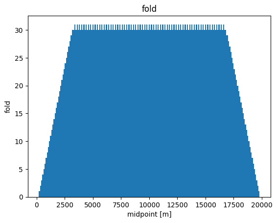

# Exercise 1: a first look at seismic data
In this exercise we will load some data into Julia and perform some basic operations.

Seismic data are typically stored in a special binary format: SEGY. These file-formats store the data as mutliple time-series (traces) with the corresponding header information containing specific information about such as time sampling and source/receiver locations.

    The Julia utilities for reading  SEGY data is SeisIO


```julia
using SeisIO, PyPlot
```

# Scaning the dataset

Thhe first step is to scan the dataset to extract header/metadat. This metadat contains the geometry and parameters of the survey such as the source/receiver locations and time sampling rate.
The convention for the metadata is as follows:
   - The Source positions use the `Source` keyword such as `SourceX`
   - The receiver position use the `Group` keyword such as `GroupX`


```julia
# scan the dataset

dir = Pkg.dir("SeisIO")
data_dir = "/src/data"

```


    "/src/data"


We ca nnow scans the dataset with the `segy_scan` functin. This function returns a `SeisCOn` object where each block is a shot record with its metadata.


```julia
blocks = segy_scan(string(dir, data_dir), "overthrust", ["GroupX", "GroupY", "ns", "dt"]);
```

    Scanning ... /nethome/mlouboutin3/.julia/v0.6/SeisIO/src/data/overthrust_2D_shot_41_60.segy
    Scanning ... /nethome/mlouboutin3/.julia/v0.6/SeisIO/src/data/overthrust_2D_shot_21_40.segy
    Scanning ... /nethome/mlouboutin3/.julia/v0.6/SeisIO/src/data/overthrust_2D_shot_61_80.segy
    Scanning ... /nethome/mlouboutin3/.julia/v0.6/SeisIO/src/data/overthrust_2D_shot_1_20.segy
    Scanning ... /nethome/mlouboutin3/.julia/v0.6/SeisIO/src/data/overthrust_2D_shot_81_97.segy


Now extract the time, source and receiver coordinates (in seconds and meters) for all the traces. The source and receiver vectors have a length equal to the number of traces, the time vector has a length equal to the number of rows in the data matrix.


```julia
sx = [get_header(blocks[i], "SourceX") for i=1:length(blocks)];
rx = [get_header(blocks[i], "GroupX") for i=1:length(blocks)];
```


```julia
# Get the tme axis. In this case the time axis is the same for all traces so we only need to extract it from the first trace
# dt needs to be corrected for the binary setup
# All the times are in ms
dt = get_header(blocks[1], "dt")[1]/1000
nt = get_header(blocks[1], "ns")[1]
T = 0:dt:(nt-1)*dt
```


    0.0:4.0:3000.0


Calculate the offset and midpoint for each trace. This gives you vectors m (midpoint) and h (offset) with length equal to the number of traces.

h = (s - r)/2;

m = (s + r)/2;


```julia
h = (sx .- rx)./2;
m = (sx .+ rx)./2;
```

The fold of the data is the number of traces in each midpoint gather. This can be easily visualized by a histogram.
As we have a set of `blocks` we need to inspect each block seperately to recover the nuique set of midpoint location and the total number fo traces for this midpoint


```julia
all_m = hcat(m'...)
fold = [sum(all_m .== unique(all_m)[i]) for i=1:length(unique(all_m))];

all_h = hcat(h'...);
```


```julia
figure();
bar(unique(all_m),fold ,align="center", width=100);
xlabel("midpoint [m]");
ylabel("fold");
title("fold");
```





Can you interpret this figure?

Different gathers

Extract a midpoint gather. For example, a midpoint gather at m = 2550 looks like this:


```julia
Im = find(all_m .== 7500.)
figure()
imshow(Float32.(blocks[1:97].data[:, Im]), vmin=-1, vmax=1, cmap="Greys", aspect=.05)
```


    PyObject <matplotlib.image.AxesImage object at 0x7f947ac9a550>


Extract an offset-gather. For example, a zero-offset section looks like:


```julia
# We need to sort it in physical units as the dataset may not be
Ih = find(all_h .== 0.)
inds = sortperm(all_m[Ih]')
figure()
imshow(Float32.(blocks[1:97].data[:, Ih[inds]]), vmin=-1, vmax=1, cmap="Greys", aspect=.1)
```


    PyObject <matplotlib.image.AxesImage object at 0x7f947ab7f048>


What other different gathers can you think of? Extract and plot an example of all the different gathers. What are characteristic properties of the different gathers? Do not forget to label the axis and choose a reasonable colorscale. Hint: use `cmap=Greys` and adjust the color-axis `vmin/vmax`
