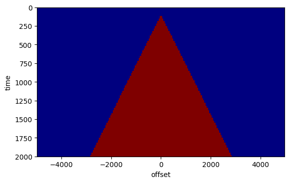

# NMO correction
The traveltime as a function of offset of a reflected event can be approximated by the NMO traveltime:

$
\tau(t_0,h) = \sqrt{t_0 + h^2/v^2}
$

where $(t_0)$ is the zero-offset or vertical traveltime and $v$ is the effective or NMO velocity.

We can now correct the data for the moveout via a simple coordinate transform:

$
d_{NMO}(t_0,h) = d(\tau(t_0,h),h)
$

You can use the function `nmo` implemented below for this exercise.


```julia
using Dierckx
function nmo(cmp, t, off, v)
# NMO correction and adjoint
#
# use:
#   out = nmo(in,t,h,v,flag)
#
# input:
#   in   - data matrix of size [length(t) x length(h)], each column is a trace
#   t    - time vector [s]
#   offsets    - offset vector [m]
#   v    - NMO velocity [m/s] as vector of size [length(t) x 1].
#   flag - 1:forward, -1:adjoint
#
# output
#   out  - data matrix of size [length(t) x length(h)], each column is a trace

    # size of data
    nt, nh = size(cmp)
    # make sure t and v are column vectors
    t = t[:]
    v = v[:]
    # initialize output
    out = zeros(nt, nh)
    # loop over offset
    for i = 1:nh
        # NMO traveltime
        tau = sqrt.(t.^2 + off[i].^2./v.^2);
        # interpolate, forward or adjoint
        spl = Spline1D(t, cmp[1e-3*T.-t.<1e-5, i])
        out[:,i] = spl(tau)
    end
    return out
end
```


    nmo (generic function with 1 method)


```julia
using SeisIO, PyPlot
```


```julia
# read the dataset

blocks = segy_read("/data/mlouboutin3/Class_data/cube2.segy");
```


```julia
sx = get_header(blocks, "SourceX";scale=false)
rx = get_header(blocks, "GroupX";scale=false);

```


```julia
# Get the time axis. In this case the time axis is the same for all traces so we only need to extract it from the first trace
# dt needs to be corrected for the binary setup
# All the times are in ms
dt = get_header(blocks, "dt")[1]/1000
nt = get_header(blocks, "ns")[1]
T = 0:dt:(nt-1)*dt
```


    0.0:4.0:2000.0


```julia
# Midpoint and offset
h = (sx .- rx);
m = (sx .+ rx)./2;
```


```julia
all_m = hcat(m'...)'
fold = [sum(all_m .== unique(all_m)[i]) for i=1:length(unique(all_m))];

all_h = hcat(h'...)';
```

# Pick a midpoint


```julia
Im = find(all_m .== all_m[1000])
offsets = sort((all_h[Im]));
inds = sortperm(all_h[Im])
cmp = Float32.(blocks.data[:, Im[inds]]);
```


```julia
figure()
imshow(cmp, vmin=-1, vmax=1, cmap="Greys", aspect=3, extent=[offsets[1], offsets[end], T[end], 0])
xlabel("offset")
ylabel("time")
```


    PyObject Text(24,0.5,'time')


# Constant velocity NMO correction


```julia
nmo_corrected1 = nmo(cmp, 1e-3.*T, offsets, 2000. + 0.*T);
```


```julia
figure()
imshow(nmo_corrected1, vmin=-1, vmax=1, cmap="Greys", aspect=3, extent=[offsets[1], offsets[end], T[end], 0])
xlabel("offset")
ylabel("time")
```


    PyObject Text(24,0.5,'time')


# Windowing
We can see a lot of `artifacts' in the NMO corrected gather above. To avoid some of the artifacts, the midpoint gathers are often windowed to select reflected data only. All events that arrive before the direct wave are removed. A typical window looks like this (Hint: the slope of the triangle is related to the veloctity of the direct wave).


```julia
# grid
tt = [1e-3*ti for ti in T for h in offsets]
hh = [h for ti in T for h in offsets]

# initialize window to zero and set times later than first arrival to 1.
W=0.*tt;W[tt.>(.1+ abs.(hh)./1500)] = 1
W = reshape(W, size(cmp)[2], size(cmp)[1])
imshow(W', vmin=0, vmax=1, cmap="jet", aspect=3, extent=[offsets[1], offsets[end], T[end], 0])
xlabel("offset")
ylabel("time")

```





    PyObject Text(24,0.5,'time')


```julia
muted = W'.*cmp;
```


```julia
figure()
imshow(muted, vmin=-1e0, vmax=1e0, cmap="Greys", aspect=3, extent=[offsets[1], offsets[end], T[end], 0])
xlabel("offset")
ylabel("time")
```


    PyObject Text(24,0.5,'time')


# Stack power
To figure out which NMO velocity optimally flattens all the events, we can scan through a range of constant NMO velocities and see which events are flattened for which velocity. One way to judge flatness of an event is via the stackpower. The stackpower is just a sum along the offset direction of the values-squared of the NMO-corrected gather:

$ S(t_0,v) = \int\!\!\mathrm{d}h\, d(\tau(t_0,h,v),h)^2 $

The function $ S(t_0,v) $ is called a semblance panel.

The desired NMO velocity can be found by picking the maximum as a function of $t_0$ and $v$ from the semblance panel.

An example of a semblance panel and the resulting NMO velocity is shown below.


```julia
v = linspace(1000, 3000, 500)
# scan over velocities
S = zeros(length(T),length(v));
for k = 1:length(v)
    cmp_nmo = nmo(muted, 1e-3.*T, offsets, v[k] .+ 0.*T);
    S[:,k]  = sum(cmp_nmo.^2,2);
end
```


```julia
#Plot semblance panel
figure()
imshow(S, vmin=0, vmax=1e3, cmap="jet", aspect=1, extent=[v[1], v[end], T[end], 0])
xlabel("velocity")
ylabel("tau")
```


    PyObject Text(24,0.5,'tau')


```julia
#  pick v/tau pairs
```


```julia
tv   = 1e3*[0,    0.30, 0.35, 0.46, 0.65, 1.27, 2.00];
vnmo =     [1500, 1500, 1600, 1700, 2000, 2179, 3000];
spl = Spline1D(tv, vnmo; k=1)
vnmo_all = spl(T);
```

# Look at the velocity profile with the picked tau/v pairs


```julia
# Enable gui to have the cursor and pick v/tau pairs
figure()
imshow(S, vmin=0, vmax=1e3, cmap="jet", aspect=1, extent=[v[1], v[end], T[end], 0])
plot(vnmo_all, T, "-k")
xlabel("velocity")
ylabel("tau")
```


    PyObject Text(24,0.5,'tau')


```julia
nmo_corrected = nmo(muted, 1e-3.*T, offsets, vnmo_all) ;
```


```julia
figure()
imshow(nmo_corrected, vmin=-1e0, vmax=1e0, cmap="Greys", aspect=3, extent=[offsets[1], offsets[end], T[end], 0])
xlabel("offset")
ylabel("time")
```


    PyObject Text(24,0.5,'time')


# Velocity analysis

Repeat the above outline procedure for a couple of mipdoint positions xm (e.g., `xm = [500 1000 2000]`). Organize the resulting NMO velocities in a matrix `Vm` (where column i is the NMO velocity for midpoint `xm[i]`) interpolate the results to obtain a velocity for all the midpoints using `Spline1D(xm, VM); spl(all_m)`. Plot the velocity and discuss.

Using this NMO velocity, we can produce an NMO stack. Perform an NMO correction of all the midpoint gathers using the corresponding NMO velocity derived above and sum each along the offset direction. Organize all the stacks in a matrix and plot the result. Also make a stack using a constant NMO velocity. Discuss the results.
