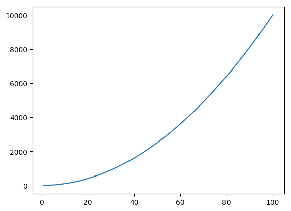

## A quick introduction to the Julia language

### Getting started
Start an interactive Julia session by running `julia` from the command line. You can quit the session with `quit()`. Generally, all functions in Julia are run using parenthesis, even if there are no input arguments.


```julia
pwd()
```


    "/home/philipp"


```julia
whos()
```

                              Base               Module
                            Compat  19502 KB     Module
                              Core               Module
                            IJulia  19567 KB     Module
                              JSON  19384 KB     Module
                              Main               Module
                           MbedTLS  19412 KB     Module
                         Nullables   1120 bytes  Module
                               ZMQ  19357 KB     Module


You can define Julia scripts as regular text files that end with `.jl` and use your favourite text editor to code. Once you have your script, e.g.:

hello-world.jl
```
println("Hello world")
```

you can run the script with `include("hello-world.jl")`.

### The Julia REPL
REPL stands for Read/Evaluate/Print/Loop and refers to the interactive Julia session (it's just like a Matlab session). It's good for experimenting, but any serious coding should be done using scripts instead.


```julia
42
```


    42


```julia
4 + 5

```


    9


```julia
100 / 5;
```

Unlike Matlab, you can access Julia's help functions by typing the question mark, followed by the function that you want the documention of:


```julia
? quit
```

    search: quit QuickSort PartialQuickSort quantile quantile!


```
quit()
```

Quit the program indicating that the processes completed successfully. This function calls `exit(0)` (see [`exit`](@ref)).


Similarly, you can enter the shell mode by typing `;`, which gives you access to a full bash terminal.


```julia
; pwd
```

    /home/philipp


In contrast to Matlab, Julia treats all operators as functions. This means you can add two numbers in either of the two ways:


```julia
a = 4 + 5
```


    9


```julia
a = +(4, 5)
```


    9


The same applies for any other operations, such as subtraction, multiplications etc. Some math constants are defined in Julia by default, such as:


```julia
print(pi)
```

    π = 3.1415926535897...

Julia was designed with the intend to write code that resembles mathematics as close as possible. For example, you can omit the multiplication operator when working with variables:


```julia
x = 5
2x + 4    # which is the same as 2*x + 4
```


    14


Just as Matlab, but different than Python, Julia comes with many built-in math functions that you would need for everyday use:


```julia
sin(pi / 2)
```


    1.0


```julia
log(100)
```


    4.605170185988092


```julia
exp(4.3)
```


    73.69979369959579


```julia
rand()
```


    0.5282624241978122


### Packages and Plotting

Packages provide additional functionalities, that are not included in core Julia. Packages are written both by official Julia programmers, as well as anyone else who programs in Julia.

Since native Julia does not include any plotting tools, we have to download a third-party package, such as `PyPlot` or `Plots`:


```julia
Pkg.add("PyPlot")
```

    INFO: Installing JUDI v0.1.0
    INFO: Building Dierckx
    

    make: Nothing to be done for `all'.


    INFO: Building Conda
    INFO: Building PyCall
    Info: PyCall is using /home/philipp/GATechBundle/Miniconda3/bin/python3 (Python 3.6.6) at /home/philipp/GATechBundle/Miniconda3/bin/python3, libpython = /home/philipp/GATechBundle/Miniconda3/lib/libpython3.6m
    Info: /home/philipp/.julia/v0.6/PyCall/deps/deps.jl has been updated
    Info: /home/philipp/.julia/v0.6/PyCall/deps/PYTHON has been updated
    INFO: Package database updated
    INFO: METADATA is out-of-date — you may not have the latest version of PyPlot
    INFO: Use `Pkg.update()` to get the latest versions of your packages
    

Once you have downloaded a package, you can use it by typing:


```julia
using PyPlot
```

This plotting package is based off Python's Matplotlib package and therefore shares much of the Syntax. Some common plotting commands include:


```julia
x = 1:100;
f = x .^ 2;
```


```julia
plot(x, f)
```





    1-element Array{PyCall.PyObject,1}:
     PyObject <matplotlib.lines.Line2D object at 0x7f4b10781d30>


```julia
A = randn(20,30);
imshow(A, extent=[0,30,20,40])
```


    PyObject <matplotlib.image.AxesImage object at 0x7f4b105585c0>


### Arrays and tuples
Arrays are defined in a similar fashion to Matlab:


```julia
x = [1, 2, 3, 4, 5]
```


    5-element Array{Int64,1}:
     1
     2
     3
     4
     5


As you can see from the output on the screen, Julia actually cares about types of variables and arrays. Since we defined our array as a collection of integers, the type of our array is `{Int64,1}


```julia
y = [1., 2., 3., 4., 5.]
```


    5-element Array{Float64,1}:
     1.0
     2.0
     3.0
     4.0
     5.0


You can make a vector out of anything, not just numbers. For example, you can collect strings in a vector like this:


```julia
s = ["This", "is", "a", "string", "vector"]
```


    5-element Array{String,1}:
     "This"  
     "is"    
     "a"     
     "string"
     "vector"


```julia
s = ["string", 4.0, sin, pi]
```


    4-element Array{Any,1}:
       "string"            
      4.0                  
       sin                 
     π = 3.1415926535897...


Multi-dimensional arrays are formed as follows:


```julia
A = [1 2 3 4; 5 6 7 8]
```


    2×4 Array{Int64,2}:
     1  2  3  4
     5  6  7  8


Note that entries of the same row are separated by spaces and rows are separated by `;`

You can also initialize vectors/matrices of a given dimension in various ways:


```julia
B = zeros(4,5)
```


    4×5 Array{Float64,2}:
     0.0  0.0  0.0  0.0  0.0
     0.0  0.0  0.0  0.0  0.0
     0.0  0.0  0.0  0.0  0.0
     0.0  0.0  0.0  0.0  0.0


```julia
C = rand(2,3)
```


    2×3 Array{Float64,2}:
     0.189405  0.938612  0.359612
     0.553322  0.868266  0.102811


```julia
D = ones(4,2)
```


    4×2 Array{Float64,2}:
     1.0  1.0
     1.0  1.0
     1.0  1.0
     1.0  1.0


Unlike Matlab, entries of matrices are accessed with square brackets, rather than parenthesis. Index counting starts at 1 (not 0).


```julia
C[1,1]
```


    0.1894051459813404


```julia
C[1,:]
```


    3-element Array{Float64,1}:
     0.189405
     0.938612
     0.359612


```julia
C[1,2:end]
```


    2-element Array{Float64,1}:
     0.938612
     0.359612


Another useful structure, e.g. for plotting and loops, are `range` and `linspace`:


```julia
r = 1:2:10
print(typeof(r))
```

    StepRange{Int64,Int64}


```julia
l = linspace(4,8.5, 7)
print(typeof(l))
```

    StepRangeLen{Float64,Base.TwicePrecision{Float64},Base.TwicePrecision{Float64}}

You can convert the vectors `r` and `l` to regular Julia arrays using the `collect` function:


```julia
collect(r)
```


    5-element Array{Int64,1}:
     1
     3
     5
     7
     9


```julia
collect(l)
```


    7-element Array{Float64,1}:
     4.0
     4.75
     5.5
     6.25
     7.0
     7.75
     8.5


Similar to Matlab, it is possible to reshape arrays or stack multiple arrays to form new matrices:


```julia
A = randn(3,4)
```


    3×4 Array{Float64,2}:
      0.509555   -1.79653    0.842718  -0.713901
     -0.0580305   0.609266   1.72787   -0.731359
      0.10706     2.91134   -1.26744   -0.0453605


```julia
reshape(A, 4, 3)
```


    4×3 Array{Float64,2}:
      0.509555   0.609266  -1.26744  
     -0.0580305  2.91134   -0.713901
      0.10706    0.842718  -0.731359
     -1.79653    1.72787   -0.0453605


```julia
vec(A)
```


    12-element Array{Float64,1}:
      0.509555
     -0.0580305
      0.10706  
     -1.79653  
      0.609266
      2.91134  
      0.842718
      1.72787  
     -1.26744  
     -0.713901
     -0.731359
     -0.0453605


```julia
B = [A; A]
```


    6×4 Array{Float64,2}:
      0.509555   -1.79653    0.842718  -0.713901
     -0.0580305   0.609266   1.72787   -0.731359
      0.10706     2.91134   -1.26744   -0.0453605
      0.509555   -1.79653    0.842718  -0.713901
     -0.0580305   0.609266   1.72787   -0.731359
      0.10706     2.91134   -1.26744   -0.0453605


One of the pitfalls of Julia is that assigning an array with the equal sign, does not copy the array, but creates a referece.


```julia
A = ones(2,3)
```


    2×3 Array{Float64,2}:
     1.0  1.0  1.0
     1.0  1.0  1.0


```julia
B = A
```


    2×3 Array{Float64,2}:
     1.0  1.0  1.0
     1.0  1.0  1.0


```julia
A[1,:] = 2
println(A)
```

    [2.0 2.0 2.0; 1.0 1.0 1.0]


```julia
show(B)

```

    [2.0 2.0 2.0; 1.0 1.0 1.0]

To copy an array, use the `copy` function


```julia
A = ones(2,3)
```


    2×3 Array{Float64,2}:
     1.0  1.0  1.0
     1.0  1.0  1.0


```julia
B = copy(A)
```


    2×3 Array{Float64,2}:
     1.0  1.0  1.0
     1.0  1.0  1.0


```julia
A[1,:] = 2
println(A)
```

    [2.0 2.0 2.0; 1.0 1.0 1.0]


```julia
println(B)
```

    [1.0 1.0 1.0; 1.0 1.0 1.0]


We see that `B` has not been changed!

Some other differences between Matlab and Julia are `min` and `max` functions. These functions only return the min/max of two input variables:


```julia
min(5,100)
```


    5


To obtain the smallest/largest entry of a vector, use the `minimum` and `maximum` functions:


```julia
x = [1,2,3,4,5,6]
println(minimum(x))
println(maximum(x))
```

    1
    6


### Controll Flow
Control flow in Julia, i.e. `if/else` statements, `for` loops or `while` loops, are similar to other programming languages. Here are some examples of different ways of controlling the flow:


```julia
for j=1:2:8
    println(j)
end
```

    1
    3
    5
    7


```julia
for color in ["red", "green", "blue"] # an array
    print(color, " ")
end
```

    red green blue


```julia
x = 10
while x > 1
    x -= 1
    println(x)
end
```

    9
    8
    7
    6
    5
    4
    3
    2
    1


```julia
name = "Julia"
if name == "Julia"
   println("I like Julia")
elseif name == "Python"
   println("I like Python.")
   println("But I prefer Julia.")
else
   println("I don't know what I like")
end
```

    I like Julia


### Functions

Functions are a useful building block to structure your code and build subroutines etc. The most generic way to define functions in Julia is like this:


```julia
function my_function(arg1, arg2)
    # do some work
end
```


    my_function (generic function with 1 method)


Functions can have any number of input arguments, including none:


```julia
function breakfast()
   maketoast()
   brewcoffee()
end
```


    breakfast (generic function with 1 method)


By default, Julia functions always return the output from the last line of function. By using the `return` keyword, you can indicate a specific value that should be returned.


```julia
function my_func(x, y)
    x_new = 2x
    y_new = 2y
end
z = my_func(3,4)
```


    8


```julia
function my_func(x, y)
    return x_new = 2x
    y_new = 2y
end
z = my_func(3,4)
```


    6


By grouping results as tuples, it is possible to return multiple variables:


```julia
function my_func(x, y)
    x_new = 2x
    y_new = 2y
    return (x_new, y_new)
end
z = my_func(3,4)
```


    (6, 8)
